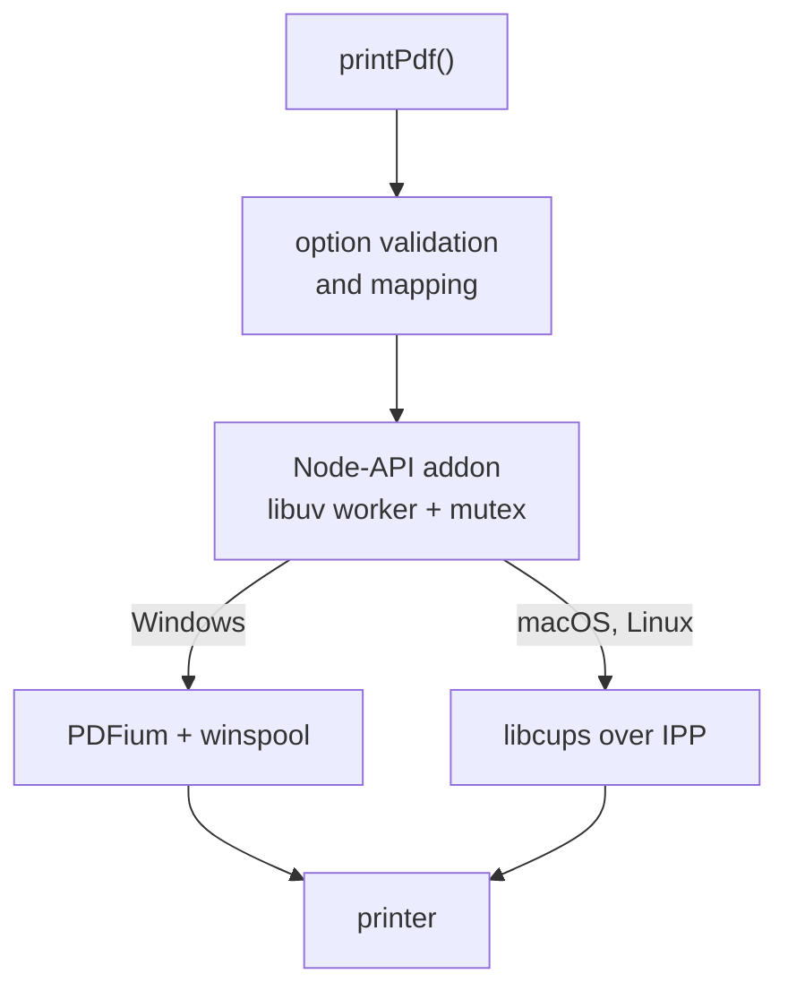

# print-it-now

Headless PDF printing for Node.js and Bun on Windows, macOS and Linux. No dialog,
no viewer, no user present.

```js
import { printPdf } from "print-it-now";

await printPdf("./invoice.pdf", { printer: "Office Laser", copies: 2, duplex: "long-edge" });
```

- **Windows** has no PDF printing of its own, so PDFium renders each page onto a
  printer device context obtained from the spooler. This is the approach
  [PdfiumViewer](https://github.com/pvginkel/PdfiumViewer) takes on .NET,
  reimplemented in C++ as a Node-API addon.
- **macOS and Linux** hand the PDF bytes straight to CUPS over IPP, because CUPS
  is itself a PDF-native print system. No rendering, no rasterising, no loss.
- **Prebuilt binaries** for eight targets, so installing needs no C++ toolchain.
- **Node and Bun**, through Node-API. Both are tested on all three platforms.
- **In-memory PDFs never touch disk.** A `Buffer` goes straight to the printing
  subsystem rather than through a temporary file.

## Install

```sh
npm install print-it-now
```

There is nothing else to install on Windows or macOS. On Linux the package needs
the CUPS client library, which most distributions already have:

| Distribution   | Package      |
| -------------- | ------------ |
| Debian, Ubuntu | `libcups2`   |
| Fedora, RHEL   | `cups-libs`  |
| Alpine         | `cups-libs`  |
| Arch           | `libcups`    |

If only the CUPS command line tools are present (`cups-client`) the package falls
back to driving `lp`, so it degrades rather than failing outright. See
[Backends](#backends).

## Usage

### Printing

```js
import { printPdf } from "print-it-now";
import { readFile } from "node:fs/promises";

// From a path. The backend streams the file, so a large PDF never has to sit in
// the JS heap.
await printPdf("./report.pdf");

// From memory. Nothing is written to disk.
await printPdf(await readFile("./report.pdf"));

// With options.
const job = await printPdf("./report.pdf", {
  printer: "Office Laser",
  jobName: "Q3 report",
  copies: 3,
  collate: true,
  pages: "1-4,8,12-",
  duplex: "long-edge",
  paperSize: "A4",
  color: "monochrome",
  scale: "shrink",
});

console.log(job);
// { jobId: 42, printer: 'Office Laser', jobName: 'Q3 report' }
```

`printPdf` resolves once the printing subsystem has **accepted** the job, which is
not the same as once it has reached paper. Poll `getJob` for that.

### Finding printers

```js
import { getDefaultPrinter, listPrinters } from "print-it-now";

for (const printer of await listPrinters()) {
  console.log(printer.name, printer.state, printer.isDefault ? "(default)" : "");
}

const fallback = await getDefaultPrinter(); // null when none is configured
```

### Following and cancelling a job

```js
import { cancelJob, getJob, printPdf } from "print-it-now";

const job = await printPdf("./large.pdf");

// null once the job has left the queue, which is what finishing looks like.
let status = await getJob(job.printer, job.jobId);
while (status && !["completed", "canceled", "aborted"].includes(status.state)) {
  await new Promise((resolve) => setTimeout(resolve, 500));
  status = await getJob(job.printer, job.jobId);
}

await cancelJob(job.printer, job.jobId);
```

### Command line

```sh
npx print-it-now report.pdf --printer "Office Laser" --pages 1-4 --duplex long-edge
npx print-it-now printers
npx print-it-now backend
cat report.pdf | npx print-it-now - --printer "Office Laser"
```

`print-it-now --help` lists every flag. `--json` makes any command
machine-readable.

## API

### `printPdf(source, options?): Promise<PrintJob>`

`source` is a file path, a `Buffer`, a `Uint8Array` or an `ArrayBuffer`.

Rejects before anything is queued if the input does not contain a `%PDF-` marker
in its first kilobyte. This check exists because the two platforms would
otherwise disagree: PDFium fails synchronously on Windows, whereas CUPS trusts
the document format a client declares and only aborts the job later during
filtering. Without it, printing an HTML error page that a failed download
produced would look like a success on Linux and a failure on Windows.

| Option                     | Type                                                    | Default          |
| -------------------------- | ------------------------------------------------------- | ---------------- |
| `printer`                  | `string`                                                | system default   |
| `jobName`                  | `string`                                                | the file name    |
| `copies`                   | `number`                                                | `1`              |
| `collate`                  | `boolean`                                               | `true`           |
| `pages`                    | `string` — `"1-3,5,8-"`                                 | all pages        |
| `pageSubset`               | `"all" \| "odd" \| "even"`                              | `"all"`          |
| `reverse`                  | `boolean`                                               | `false`          |
| `duplex`                   | `"simplex" \| "long-edge" \| "short-edge"`              | driver default   |
| `orientation`              | `"portrait" \| "landscape"`                             | driver default   |
| `paperSize`                | name or `{ widthMm, heightMm }`                         | driver default   |
| `tray`                     | `string \| number`                                      | driver default   |
| `color`                    | `"color" \| "monochrome" \| "auto"`                     | driver default   |
| `quality`                  | `"draft" \| "normal" \| "high"`                         | driver default   |
| `scale`                    | `"actual" \| "fit" \| "shrink" \| "noscale-clip"`       | `"shrink"`       |
| `dpi`                      | `number` — Windows bitmap mode only                     | device native    |
| `numberUp`                 | `1 \| 2 \| 4 \| 6 \| 9 \| 16`                           | `1`              |
| `ipp`                      | `Record<string, string>` — raw IPP, CUPS only           | none             |
| `windows`                  | see [Windows options](#windows-options)                 | —                |
| `ignoreUnsupportedOptions` | `boolean`                                               | `false`          |

Options left unset are **not** sent, so the queue's own configuration survives.
Setting `orientation: "portrait"` on a queue an administrator configured for
landscape would override it; omitting it will not.

#### Scaling modes

- `actual` — 100% of the PDF's page size, centred on the sheet. Content in the
  unprintable margin is lost, which is what "actual size" means.
- `fit` — scaled up or down so the whole page fits the printable area.
- `shrink` — like `fit`, but never enlarges. The usual viewer default, and this
  package's.
- `noscale-clip` — 100%, anchored at the printable origin, overflow clipped.
  Predictable for labels and pre-printed stationery, where centring would move
  content relative to what is already on the paper.

#### Paper sizes

`A0`–`A6`, `B4`, `B5`, `Letter`, `Legal`, `Tabloid`, `Ledger`, `Executive`,
`Statement`, `Folio`, `Quarto`, `Env10`, `EnvDL`, `EnvC4`, `EnvC5`, `EnvC6`,
`EnvMonarch`, `Photo4x6`. Matching ignores case, spaces, hyphens and underscores,
so `"US Letter"`, `"us-letter"` and `"usletter"` are the same size.
`knownPaperSizeNames()` returns the list. Anything else can be given as
`{ widthMm, heightMm }`.

### `listPrinters(): Promise<Printer[]>`

### `getDefaultPrinter(): Promise<Printer | null>`

### `getJob(printer, jobId): Promise<JobStatus | null>`

`null` means the job has left the queue, which is what completion looks like on
both platforms — not that it never existed.

### `cancelJob(printer, jobId): Promise<void>`

### `getBackendInfo(): Promise<BackendInfo>`

Which backend is active and what it is built on. Worth including in a bug report.

### `parsePageRanges(expression): PageRange[]`

Exported so a range expression can be validated before it is used.

## Errors

Every error is a `PrintError` subclass carrying a stable `code`, so failures can
be handled without matching on messages.

| Class                     | `code`                | Means                                                     |
| ------------------------- | --------------------- | --------------------------------------------------------- |
| `InvalidOptionError`      | `EINVALIDOPTION`      | An option was malformed. Has `.option`.                   |
| `UnsupportedOptionError`  | `EUNSUPPORTEDOPTION`  | Valid, but this platform cannot honour it.                 |
| `NoPrinterError`          | `ENOPRINTER`          | No printer named and no system default.                   |
| `PrinterNotFoundError`    | `EPRINTERNOTFOUND`    | The named queue does not exist.                           |
| `InvalidPdfError`         | `EINVALIDPDF`         | Not a PDF, unreadable, or password protected.              |
| `BackendError`            | `EBACKEND`            | The printing subsystem rejected or failed the job.         |
| `BackendUnavailableError` | `EBACKENDUNAVAILABLE` | No printing subsystem could be reached at all.             |
| `JobNotFoundError`        | `EJOBNOTFOUND`        | That queue has no such job.                                |

```js
import { printPdf, PrinterNotFoundError } from "print-it-now";

try {
  await printPdf("./a.pdf", { printer: "Typo" });
} catch (error) {
  if (error instanceof PrinterNotFoundError) {
    // error.message already lists the printers that do exist.
  }
}
```

### Unsupported options fail loudly

An option the active backend cannot honour raises `UnsupportedOptionError`
instead of being quietly dropped, because a job that silently comes out different
from what was asked for is worse than one that fails. Pass
`ignoreUnsupportedOptions: true` to downgrade that to a no-op.

## Platform behaviour

The API is the same everywhere, but the two printing subsystems are not, and
pretending otherwise would be the wrong kind of abstraction.

| Option              | Windows                                       | macOS / Linux (CUPS)                            |
| ------------------- | --------------------------------------------- | ----------------------------------------------- |
| `pages`, `reverse`  | applied here, page by page                    | `page-ranges` / `outputorder`, applied by CUPS  |
| `pageSubset`        | applied here                                  | `page-set`                                      |
| `copies`, `collate` | driver if it can, otherwise repeated here     | `copies`, `multiple-document-handling`          |
| `paperSize`         | `DEVMODE` size, or custom dimensions          | PWG media name                                  |
| `duplex`            | `dmDuplex`                                    | `sides`                                         |
| `color`             | `dmColor`                                     | `print-color-mode`                              |
| `quality`           | `dmPrintQuality`                              | `print-quality`                                 |
| `tray`              | `DMBIN_*` name or numeric driver bin id       | `media-source`, passed through verbatim         |
| `scale`             | all four modes                                | `fit-to-page`; `noscale-clip` **throws**        |
| `dpi`               | `bitmap` render mode only                     | **throws** — CUPS chooses the resolution        |
| `numberUp`          | **throws** — see below                        | `number-up`                                     |
| `ipp`               | ignored                                       | merged last, so it overrides everything else    |
| `windows`           | see below                                     | ignored                                         |

`pageCount` comes back on `PrintJob` only from Windows, which does the imposition
itself and therefore knows. CUPS resolves `page-ranges` server-side.

### Things worth knowing

**`numberUp` on Windows.** Windows drivers expose pages-per-sheet through private
`DEVMODE` extensions that cannot be set portably, so this throws rather than
pretending. Impose the pages into a single PDF first.

**`numberUp` with `pages` on CUPS.** cups-filters applies `page-ranges` *after*
N-up imposition, not before, so `{ pages: "1-4", numberUp: 2 }` on an 8-page
document yields four sheets rather than two. This is upstream behaviour — plain
`lp` does exactly the same — and this package reproduces it rather than papering
over it.

**`scale: "shrink"` on CUPS.** CUPS has no shrink-only mode; `fit-to-page` scales
in both directions. Since `shrink` is this package's default rather than an
explicit request, nothing is sent and the queue's own scaling policy applies. Ask
for `fit` when scaling up is genuinely wanted.

**Saved user defaults on CUPS.** Anything set with `lpoptions` fills in options
the caller did not specify, which is the behaviour `lp` has always had. Explicit
options always win.

**Job status detail.** Windows reports `totalPages` and `pagesPrinted`; CUPS does
not carry them on a job record, so they are absent there.

### Windows options

```js
await printPdf("./a.pdf", {
  windows: {
    renderMode: "vector", // or "bitmap"
    printMode: "emf", // PDFium print mode, vector only
    outputFile: "C:\\out\\result.pdf", // for file-backed drivers
  },
});
```

**`renderMode`.** `vector` (the default) renders through PDFium's Windows print
device, producing EMF or PostScript: text stays sharp at the device's native
resolution and spool files stay small. `bitmap` rasterises each page to a DIB and
blits it — slower and larger, but the reliable choice for drivers that mishandle
EMF records. Tall or high-resolution pages are rendered in horizontal bands, so a
600 dpi A3 page does not need its full ~190 MB allocated at once.

**`printMode`.** Forwarded to PDFium's `FPDF_SetPrintMode`: `emf`, `text-only`,
`postscript2`, `postscript3`, `postscript2-passthrough`,
`postscript3-passthrough`, `emf-image-masks`, `postscript3-type42`,
`postscript3-type42-passthrough`. The PostScript modes are worth trying with a
PostScript printer whose driver renders EMF poorly.

**`outputFile`.** Required by drivers that write to a file rather than a device,
including "Microsoft Print to PDF". Without it, such a driver waits on a save
dialog that a headless process will never answer, and the job fails with a
message saying so.

## Backends

`getBackendInfo()` reports which of three paths is in use:

| `backend`     | When                                       | Built on                          |
| ------------- | ------------------------------------------ | --------------------------------- |
| `windows`     | Windows                                    | PDFium + winspool/GDI             |
| `cups`        | macOS and Linux with the CUPS library      | `libcups` over IPP                |
| `lp-fallback` | POSIX with the CUPS tools but no library   | `lp`, `lpstat`, `cancel`          |

The fallback exists so a slim container that installed `cups-client` but not
`libcups2` still prints. It is not equivalent: it spawns a process per job, cannot
report job status, and reports printer state as `unknown`, because the command
line tools only give it as localised prose. Install the CUPS library for the full
feature set.

Set `PRINT_IT_NOW_BACKEND=lp` to force the fallback, which is how CI keeps it from
rotting.

## Environment variables

| Variable                     | Effect                                                        |
| ---------------------------- | ------------------------------------------------------------- |
| `PRINT_IT_NOW_BACKEND`       | `lp` forces the CUPS command line fallback.                    |
| `PRINT_IT_NOW_CUPS_LIBRARY`  | Full path to `libcups`, when it is somewhere unusual.          |
| `PRINT_IT_NOW_PDFIUM_PATH`   | Full path to `pdfium.dll`, to use a different build.           |

## How it works



Every backend call runs on a libuv worker thread, so the event loop is never
blocked, and they are serialised behind one mutex: PDFium is not thread-safe, and
a printer device context must not be driven from two threads at once. Printing is
inherently serial per queue, so this costs nothing in practice.

On Windows the sequence is the one PdfiumViewer uses. The driver's current
settings are read with `DocumentPropertiesW`, the requested options are applied,
and the result is round-tripped back through the driver so an unsupported paper
size or duplex request degrades the way the device wants instead of failing. A
device context comes from `CreateDCW`, and then each selected page is rendered
between `StartPage` and `EndPage`. A failure part-way through calls `AbortDoc`
rather than `EndDoc`, so a half-rendered document never reaches paper.

`pdfium.dll` is loaded by absolute path from beside the addon, not through the
DLL search order, so a different `pdfium.dll` already on `PATH` or in the process
cannot be picked up instead.

On CUPS the job is streamed with `cupsCreateJob`, `cupsStartDocument`,
`cupsWriteRequestData` and `cupsFinishDocument`, which is what lets in-memory
input reach the queue without a temporary file. The CUPS API is bound through
`dlopen` rather than link-time linking, so the addon still loads on a machine with
no CUPS and reports a clear error instead of failing to load.

## Building from source

Prebuilt binaries cover Windows, macOS and Linux on x64 and arm64, including musl.
On anything else, `npm install` compiles the addon, which needs a C++17 compiler,
Python 3 and `make` (or Visual Studio Build Tools on Windows). No CUPS or PDFium
development package is required: the CUPS bindings are declared in-tree, and
PDFium's header is vendored.

```sh
git clone https://github.com/iteufel/print-it-now
cd print-it-now
npm install
npm run build          # addon + TypeScript
npm test               # unit tests
```

Windows also needs the PDFium runtime, staged from a sha256-pinned
[bblanchon/pdfium-binaries](https://github.com/bblanchon/pdfium-binaries) release:

```sh
node scripts/fetch-pdfium.mjs
```

### Testing

```sh
npm test                             # unit tests, no printer needed
npm run check:windows-sources        # cross-compile the Windows backend on Linux
bash scripts/setup-test-printer.sh   # create a file-backed queue, prints the env to use
npm run test:e2e                     # print for real and check the output
bun test/smoke/bun-smoke.mjs         # verify the addon under Bun
```

The end-to-end suite prints through the platform's real printing subsystem and
inspects the resulting PDF, so page ranges, paper sizes and copies are checked
against what actually came out rather than against what was asked for.

`scripts/check-windows-sources.sh` compiles the Windows backend with MinGW-w64 so
contributors on Linux get that feedback without waiting for a Windows runner. It
is not a substitute for the real MSVC build, but it catches the ordinary mistakes.

## Licence

MIT. See [LICENSE](LICENSE).

Windows builds redistribute PDFium, a project of The Chromium Authors, under the
BSD 3-Clause licence; see
[native/third_party/pdfium/LICENSE](native/third_party/pdfium/LICENSE). PDFium
binaries come from [bblanchon/pdfium-binaries](https://github.com/bblanchon/pdfium-binaries).
